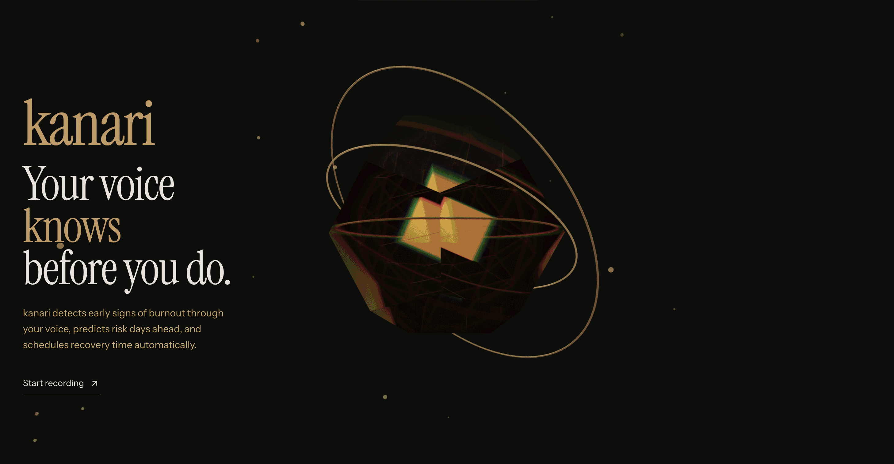

# kanari

**Track stress + fatigue patterns before you crash.** A browser-based wellness tool that uses AI voice check-ins to extract on-device acoustic features, compute a heuristic 3-7 day risk forecast from trends, and help you schedule recovery time.

[](https://gemini3.devpost.com)
[]()



---

## What is kanari?

kanari helps remote workers and professionals track stress and fatigue signals through daily AI voice check-ins. Have a 30-60 second conversation with Gemini about your day. The app extracts acoustic features in your browser, trends your scores over time, computes a short-horizon (3-7 day) forecast with confidence, and suggests recovery actions.

This is not medical advice and it does not diagnose burnout.

---

## Features

### Core
- **AI Voice Check-ins**: Conversational check-ins powered by Gemini Live - speak naturally, get real-time responses
- **Acoustic Biomarker Analysis**: Detects stress and fatigue from speech rate, pitch variations, pause patterns, and spectral features
- **Semantic Fusion**: Combines acoustic signals with conversation content for more accurate scoring
- **Burnout Forecasting**: Heuristic 3-7 day risk forecast from recent trends (with confidence)
- **Check-in Synthesis**: AI-generated summaries with insights and journal entries after each session

### Personalization
- **30+ AI Voices**: Choose from distinct Gemini voices with audio preview
- **Biomarker Calibration**: Personalize stress and fatigue baselines to your unique voice patterns
- **Interactive Widgets**: Breathing exercises, stress gauges, quick actions triggered during check-ins
- **Recovery Suggestions**: Context-aware recommendations based on your conversation and biomarkers

### Integration
- **Local Calendar**: Schedule recovery blocks directly in Kanari
- **Week View**: Visual scheduler showing your recovery activities
- **Achievement System**: Track streaks and milestones

### Demo
- **Guided Feature Tour**: Interactive walkthrough on the landing page (see `/#features`) showcasing features with short video demos
- **Demo Mode**: One-click seeded workspace so you can explore the dashboard without doing a real check-in

### Privacy
- **On-device Features**: Acoustic feature extraction runs in your browser (voice patterns/biomarkers)
- **Gemini Usage**: Live check-in audio is streamed to Gemini for conversation and synthesis
- **Flexible API Keys**: Use the built-in demo key or bring your own Gemini API key (free tier available)
- **No Account Required**: Data stored locally in IndexedDB

---

## How It Works

1. **Check in**: Start a voice conversation with Gemini about your day
2. **Analyze**: Local acoustic processing extracts biomarkers while Gemini provides real-time responses
3. **Synthesize**: Get AI-generated insights, journal entries, and recovery suggestions
4. **Schedule**: Book recovery activities directly to your calendar

---

## Tech Stack

| Category | Technologies |
|----------|-------------|
| Frontend | Next.js 16, React 19, Tailwind CSS 4, Framer Motion |
| Audio | Web Audio API, Meyda, @ricky0123/vad-web |
| AI | Gemini 3 Flash (REST), Gemini Live (WebSocket) |
| Storage | IndexedDB (Dexie), Web Crypto API |
| Integration | Local calendar scheduler |

---

## Quick Start

```bash
git clone https://github.com/seanesla/kanari.git
cd kanari
pnpm install
cp .env.example .env.local
pnpm dev
```

Open `http://localhost:3000` in Chrome, Safari, or Firefox.

The onboarding flow will guide you to:
1. Choose an API key option: use the built-in demo key OR get your own free key from [Google AI Studio](https://aistudio.google.com/apikey)
2. Configure your preferences (check-in duration, voice activity detection)
3. Choose your accent color

---

## Privacy

All acoustic analysis (speech rate, spectral features, pause patterns) happens locally in your browser. Audio is sent to Gemini only for conversation and semantic analysis. No personal identifiers are collected. Data is stored locally in IndexedDB.

---

## Hackathon

Built for the **Google DeepMind Gemini 3 Hackathon** (Dec 2025 - Feb 2026).

Uses Gemini 3 Flash for:
- Real-time voice conversations (Gemini Live WebSocket)
- Burnout risk prediction and forecasting
- Personalized recovery suggestion generation
- Check-in synthesis and journaling

---

## Links

| Resource | URL |
|----------|-----|
| Live Demo | https://kanari.space |
| Demo Video | `[VIDEO_URL]` |
| Devpost | `[DEVPOST_URL]` |

---

## Team

| Name | LinkedIn |
|------|----------|
| Sean Esla | [linkedin.com/in/seanesla](https://linkedin.com/in/seanesla) |
| Aleksandr Ershov | [linkedin.com/in/aleksershov](https://linkedin.com/in/aleksershov) |

---

## Disclaimer

kanari is a wellness tool, not a medical device. It does not diagnose, treat, or prevent any disease. Consult a healthcare professional for mental health concerns.
